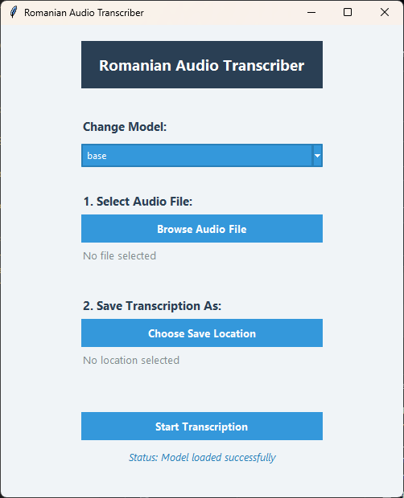

# Romanian Audio Transcriber 🎙️➡️📝

A desktop application for transcribing Romanian audio files to text using faster-whisper. Works **100% offline** .
Has GPU suppport for faster transcribing.



## 📑 Table of Contents

- [Project Structure](#-project-structure)
- [Key Features](#-key-features)
- [Prerequisites](#-prerequisites)
- [Installation & Build](#-installation--build)
- [Model Management](#-model-management)
- [Usage Guide](#-usage-guide)
- [Deployment](#-deployment)
- [TODO](#-todo)
- [License](#-license)

## 📂 Project Structure

`romanian-audio-transcriber`

- `main.py` - Main entry point of the application
- `transcriber.py` - Core transcription logic (Transcriber class) and tkinter GUI
- `package.spec` - PyInstaller configuration file
- `requrements.txt` - Python dependencies list

## 🎯 Key Features

- Romanian Language Focus 🇷🇴 -
  Optimized for Romanian speech patterns and diacritics

- Offline Operation 🔒 -
  No internet connection required post-installation and post downloading the needed models

- Long Audio Support ⏳ -
  Handles files up to 3+ hours efficiently

- Custom Model Support 🧠 -
  Easily swap between different whisper models

## 🛠️ Prerequisites

- Python 3.12+
- (Optional) NVIDIA GPU supporting CUDA 12 and cuDDN 9


## 🚀 Installation & Build

```bash
# 1. Clone with submodules
git clone https://github.com/pireu2/romanian-audio-transcriber.git
cd romanian-audio-transcriber

# 3. Install Python dependencies if you want to deploy the application
pip install -r requirements.txt

# 4 (optional) Install the cuda dependencies if your hardware supports it
pip install -r requirements_cuda.txt

# 4. Run application
python main.py
```

## 🔧 Model Management

Default Model Configuration

```python
#transcriber.py
MODEL_CONFIG = {
    "name": "base",
    "language": "ro",
}
```

The model can be changed to one of the following using the gui but the default will be base when opening the app:

- tiny
- base
- small
- medium
- large-v1
- large-v2
- large-v3

Bigger models have more accuracity but they are slower at transcribing, the base one has a nice ballance.

## 📝 Usage Guide

- Change the model (optional)
- Select audio file (.mp3, .wav, .ogg)
- Choose output path (default: same as input)
- Click "Transcribe"
- Review/edit text in your default editor

## 📦 Deployment

### Currently doesn't work

Create standalone executable:

```bash

pyinstaller package.spec
```

Output executable located in /dist with:

- Complete Romanian language support

## ✅ TODO

- ❌ Add more unit tests for the transcription logic
- ❌ Implement performance testing for long audio files
- ✅ Explore GPU implementation for faster transcription
- ❌ Improve error handling and user feedback
- ❌ Add a progress bar for the transcription process
- ❌ Create a detailed user manual

## 📜 License

MIT License - See [LICENSE](LICENSE)
